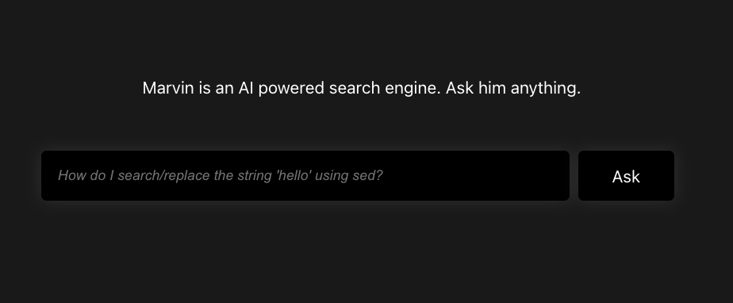
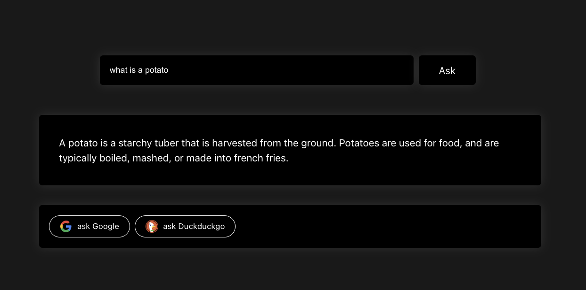

# Marvin: OpenAI API Usage example in a react app

This app is an example search engine implementation of OpenAI's GPT API using `react.js` with Firebase as a backend.





- [Try the live demo here]( https://marvin-development-7a4f7.web.app/ )
- Do you have questions, comments, or feature requests? [Open an issue here](https://github.com/actuallymentor/battery/issues) or [Tweet at me](https://twitter.com/actuallymentor).

## Requirements

- [node.js 16]( https://nodejs.org/en/ ) (note, this repo has an `.nvmrc` for use with [nvm](https://github.com/nvm-sh/nvm))
- A [Firebase project](https://console.firebase.google.com/) with billing enabled
- [OpenAI API keys]( https://beta.openai.com/account/api-keys )

## Installation

Step 1: clone this repository:

```shell
git clone https://github.com/actuallymentor/marvin.git
```

Step 2: install all dependencies

```shell
cd marvin
npm i
cd functions
npm i
cd ..
```

Step 3: set environment variables

```shell
# This file is called .env in the project root

# Firebase configs
REACT_APP_apiKey=
REACT_APP_authDomain=
REACT_APP_projectId=
REACT_APP_storageBucket=
REACT_APP_messagingSenderId=
REACT_APP_appId=
REACT_APP_measurementId=

# Recaptcha/appcheck config, get these at "AppCheck" in the firebase console and https://www.google.com/recaptcha/admin
REACT_APP_APPCHECK_DEBUG_TOKEN=
REACT_APP_recaptcha_site_key=

# Whether to use the local firebase emulator
REACT_APP_useEmulator=true
```

```shell
# This file is called .env in the ./functions folder

# Find this at https://beta.openai.com/account/org-settings
OPENAI_ORG=

# Find this at https://beta.openai.com/account/api-keys
OPENAI_APIKEY=

# See pricing differences at https://openai.com/api/pricing/
OPENAI_MODEL="text-davinci-003"
```

## Running it locally

To run this locally you need 2 things:

1. To run the react frontend
2. To run the Firebase functions emulator (which allows you to see logs as well)

To do this:

1. Open 2 terminal windows
2. Navigate to the project directory
3. In the project root run `npm start`
4. In the second window open `./functions` and run `npm run serve`
5. Open `http://localhost:3000/` in a browser

You can now play with the code.